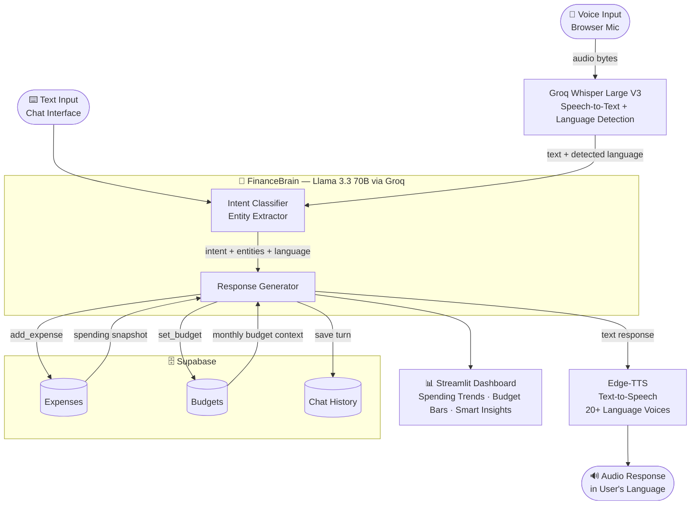

# FinBot — AI Voice Financial Assistant

> Say *"I spent ₹450 on food"* → FinBot logs it, checks your budget, and talks back. In your language.


🔗 **[Try the Live App](https://finbot-ubucudqttyqsz37bbxqjan.streamlit.app)**

<!-- 🎬 Add demo GIF here -->

---

## Architecture



---

## How It Works

1. **Speak or type** — the browser mic captures your voice, or you type directly
2. **Whisper transcribes** — Groq's Whisper Large V3 converts speech to text and detects your language automatically
3. **Llama reasons** — Llama 3.3 70B classifies your intent, extracts entities (amount, category, date), and loads your live financial context from Supabase
4. **Action is taken** — expense logged / budget updated / advice generated
5. **You hear the response** — Edge-TTS synthesises audio in your detected language and plays it back

**End-to-end latency: ~3–5 seconds**

---

## Features

| Feature | Detail |
|---|---|
| 🎤 Voice-first UX | Speak naturally — no forms, no dropdowns |
| 🌍 20+ Languages | Auto-detects Hindi, Tamil, Spanish, French, Japanese, and more — responds in kind |
| 🧠 Intent Engine | Classifies: `add_expense` · `query_balance` · `get_advice` · `set_budget` · `greeting` |
| 📊 Live Dashboard | Spending trends (7-day), category breakdown donut chart, budget progress bars |
| ⚠️ Budget Alerts | Flags categories as `OVER` / `WARNING` / `ON TRACK` with end-of-month projections |
| 💬 Conversation Memory | Retains last 20 messages for coherent multi-turn dialogue |
| 🔒 Multi-user Auth | Supabase authentication with row-level security — every query is scoped to the logged-in user |
| 💸 Zero Cost | Groq (free) + Supabase (free) + Edge-TTS (free) + Streamlit Cloud (free) |

---

## Tech Stack

| Layer | Technology | Why |
|---|---|---|
| Frontend | Streamlit | Session state, mic recorder, Plotly charts, and cloud deployment — all in one framework |
| LLM | Llama 3.3 70B via Groq | Sub-second inference — ~10× faster than OpenAI at zero cost |
| Speech-to-Text | Groq Whisper Large V3 | 90+ language support on the same Groq key — no extra API or GPU required |
| Text-to-Speech | Microsoft Edge-TTS | No API key needed, 20+ language-matched neural voices, async — adds near-zero latency |
| Auth + Database | Supabase | Row-level security enforces user data isolation at the DB layer, not in app code |
| Visualisation | Plotly + Pandas | Interactive charts without adding a separate frontend framework |

> **Total cost to run: $0** — every layer runs on free tiers, no GPU required.

---

## Project Structure

```
Finbot/
├── app.py                     # Streamlit UI + pipeline orchestration
├── auth/
│   └── auth.py                # Supabase login, signup, session, default budget seeding
├── brain/
│   └── llm.py                 # Intent classification, entity extraction, LLM response
├── finance/
│   └── database.py            # ExpenseTracker, BudgetAnalyzer, ChatHistory — Supabase queries
├── voice/
│   ├── stt.py                 # Speech-to-text (Groq Whisper + local offline fallback)
│   └── tts.py                 # Text-to-speech (Edge-TTS, async, 20+ language voices)
├── tests/
│   ├── test_llm.py            # Intent classification + language detection tests
│   ├── test_database.py       # Financial context generation tests
│   └── test_tts.py            # Voice selection tests
└── ARCHITECTURE.md            # Design decisions and trade-off rationale
```

---

## Quick Start

**Prerequisites:** Python 3.10+, a free [Groq API key](https://console.groq.com), a free [Supabase project](https://supabase.com)

```bash
git clone https://github.com/logn1602/Finbot.git
cd Finbot
python -m venv venv

# Windows
venv\Scripts\activate
# macOS/Linux
source venv/bin/activate

pip install -r requirements.txt
```

Create a `.env` file:

```env
GROQ_API_KEY=your_groq_api_key
SUPABASE_URL=https://your-project.supabase.co
SUPABASE_ANON_KEY=your_supabase_anon_key
```

```bash
streamlit run app.py
# Opens at http://localhost:8501
```

### Deploy to Streamlit Cloud (free)

1. Fork this repo
2. Go to [share.streamlit.io](https://share.streamlit.io) → connect your GitHub
3. Set main file to `app.py`
4. Under **Advanced settings → Secrets**, add:
```toml
GROQ_API_KEY = "your_groq_api_key"
SUPABASE_URL = "https://your-project.supabase.co"
SUPABASE_ANON_KEY = "your_supabase_anon_key"
```
5. Click **Deploy** — live in under 2 minutes

---

## Sample Interactions

```
You:    "I spent 200 on groceries today"
FinBot: "Logged $200 under Food. You've used 65% of your monthly food budget — $800 remaining."

You:    "Mujhe apna is mahine ka kharcha batao"   ← Hindi
FinBot: "Is mahine aapne $420 kharch kiye hain — sabse zyada Transport mein $150."

You:    "Am I overspending?"
FinBot: "Entertainment is at 112% of budget. Every other category is on track for the month."

You:    "set my food budget to 600"
FinBot: "Done! Food budget updated to $600. You've spent $420 so far — $180 left this month."
```

---

## Supported Languages

English · Hindi · Tamil · Telugu · Bengali · Marathi · Gujarati · Kannada · Malayalam · Punjabi · Urdu · Spanish · French · German · Chinese · Japanese · Korean · Arabic · Portuguese · Russian · Italian

Language is **auto-detected** from your voice or text — no manual selection needed.

---

## Dashboard Features

- **Monthly / daily spending totals** with real-time updates
- **Budget progress bars** with ON TRACK / WARNING / OVER badges
- **Category breakdown** donut chart
- **7-day spending trend** line chart
- **Smart insights** — overspending alerts, spending spikes, top category callouts

---

## Offline Fallback

`voice/stt.py` includes a `SpeechToTextLocal` class that runs Whisper locally if internet is unavailable. No GPU required for `small` or `base` model sizes.

---

## License

Developed as an academic project for EAI 6010 at Northeastern University. Open-source under MIT.
